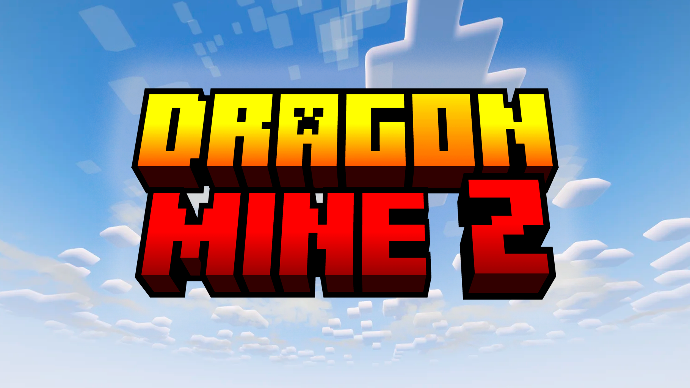

### _**Home**_

Welcome to the DragonMine Z documentation! Here you will find almost everything you need to know about the mod.

DragonMine Z is an immersive mod for Minecraft Forge 1.20.1, based on the Akira Toriyama's most famous work, Dragon Ball Z.
The mod adds a lot of new features to the game, such as Custom Character creation and personalization, Stats System, Skills System, Transformations,
Storyline, Dimensions, NPCs, and much more!

The mod is still in development, so some features may not be available yet. And some features may be subject to change.
But don't worry, we are working hard to bring you the best Dragon Ball Z experience in Minecraft!

**Please note that DragonMine Z requires GeckoLib to work properly. You can download it from [CurseForge](https://www.curseforge.com/minecraft/mc-mods/geckolib) or [Modrinth](https://modrinth.com/mod/geckolib).**

## **First Steps**

- [Getting Started](wiki/gettingstarted.md)
- [Character Creation](wiki/character.md)
- [Locations](wiki/locations.md)

## **Servers and Multiplayer**

- [Mod Configuration](wiki/servers/generalconfig.md)
- [Server Commands](wiki/servers/commands.md)
- [Racial Configurations](wiki/servers/racialconfig.md)

## **Advanced Topics**

- [Credits](about/credits.md)
- [License / Permissions](about/license.md)
- [Support the Project](about/support.md)
- [Code of Conduct](about/code-of-conduct.md)
